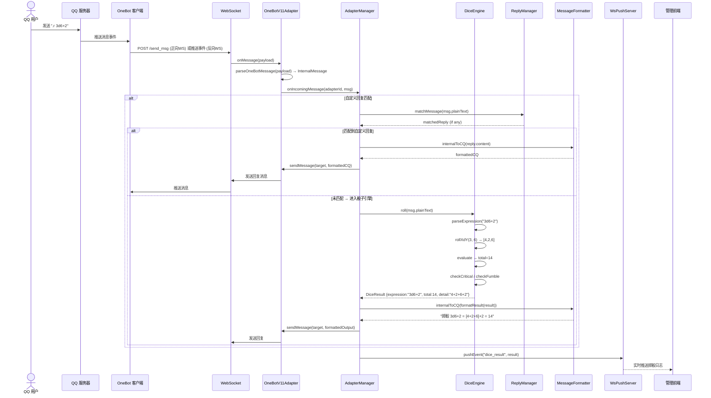
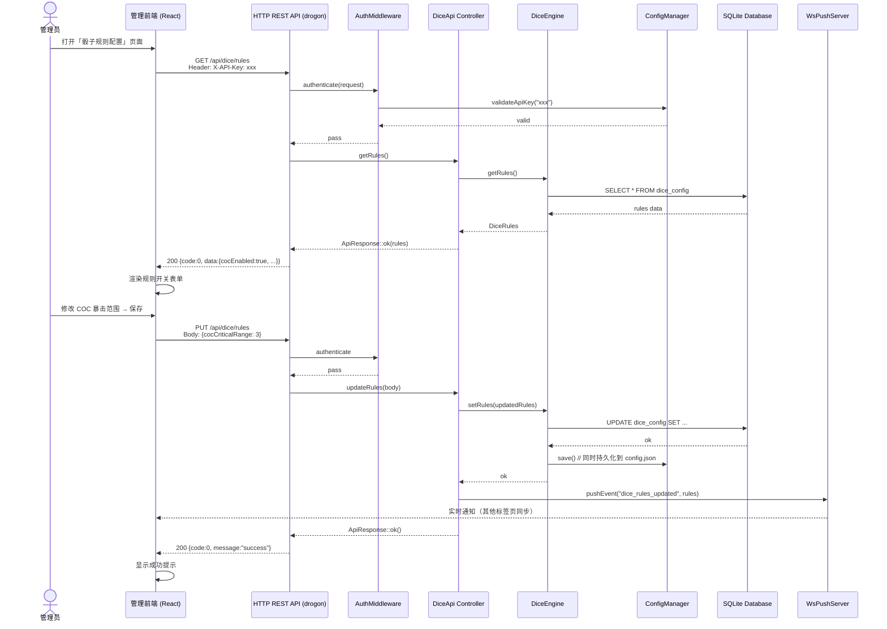
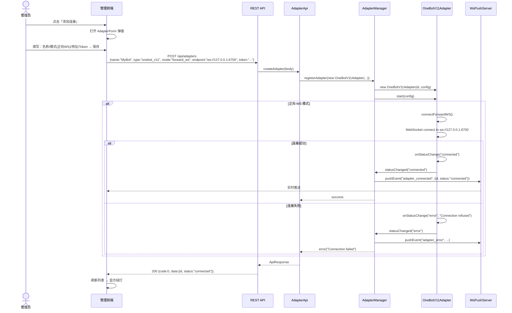
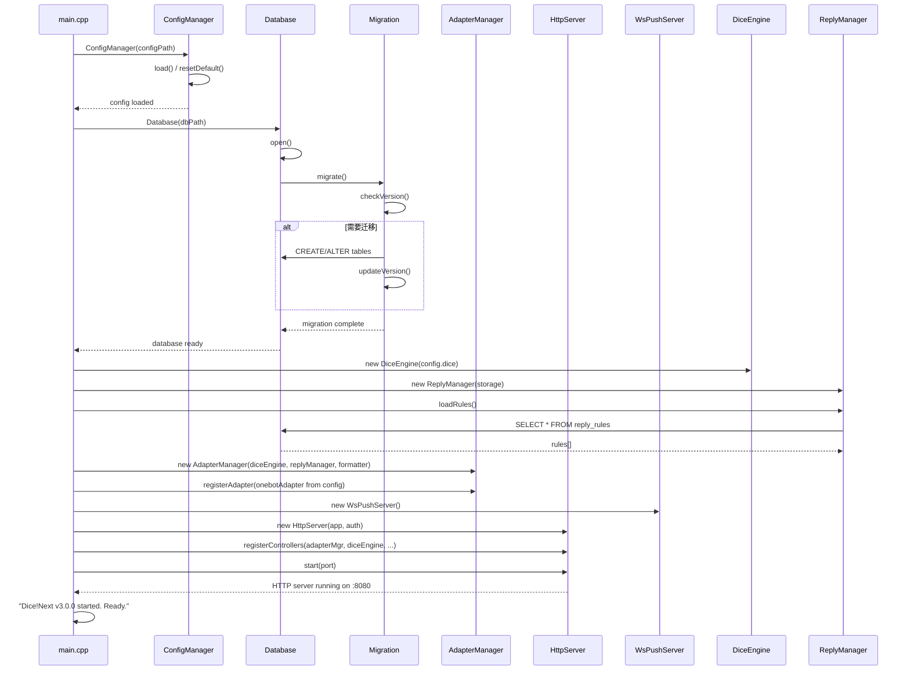
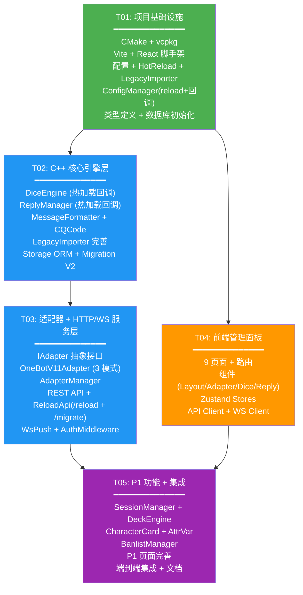

# Dice! 重构项目 — 系统架构设计文档

> **架构师**: Bob | **日期**: 2025-06-14 | **版本**: v1.1 (修订: 补全热加载 + 旧数据迁移)

---

## Part A: 系统设计

---

### 1. 实现方案（Implementation Approach）

#### 1.1 核心技术挑战

| 挑战 | 分析 | 解决方案 |
|------|------|----------|
| C++ 单体 DLL → 前后端分离 | 原 113 个源文件紧密耦合，需解耦为独立模块 | 分层架构：Adapter 层 / Service 层 / Core 层 / Storage 层 |
| OneBot v11 多连接模式 | 正向 WS、反向 WS、HTTP 三种模式需统一抽象 | 抽象 `IAdapter` 接口，OneBotV11Adapter 内部封装三种传输 |
| 适配器扩展性 | 未来需支持 Milky 等协议，不能硬编码 OneBot | 插件式 Adapter 接口（抽象基类 + 工厂注册），P0 阶段定义接口 |
| CQ 码富文本兼容 | OneBot v11 使用 CQ 码，需保留完整格式化能力 | 独立 MessageFormatter 模块，CQ 码 ↔ 内部表示双向转换 |
| Web 面板实时性 | 日志、连接状态需实时推送 | 后端 WebSocket 推送 + 前端 useWebSocket Hook |
| 热加载配置 | 配置变更后（骰子规则、回复、黑名单等）需要自动生效，无需重启 | HotReloadMonitor 文件监听（inotify/ReadDirectoryChangesW）+ `POST /api/system/reload` API 触发双通道 |
| 旧数据兼容 | Dice! 原 CoolQ DLL 项目使用 JSON/自定义格式存储数据，非 SQLite | LegacyImporter 读取旧 JSON 格式并转换写入新 SQLite schema |

#### 1.2 框架与库选型

**后端（C++）:**

| 用途 | 选型 | 版本 | 理由 |
|------|------|------|------|
| 构建系统 | CMake | ≥ 3.20 | 跨平台、生态完善、与 vcpkg 深度集成 |
| 包管理 | vcpkg | latest | Microsoft 官方维护，C++ 包管理事实标准 |
| HTTP/WS 框架 | **drogon** | ≥ 1.9 | 原生支持 HTTP + WebSocket + 中间件，异步非阻塞，性能优异 |
| JSON 解析 | **nlohmann/json** | ≥ 3.11 | 头文件库，API 直觉，与 STL 容器无缝互操作 |
| 数据库 | **SQLite3** + **sqlite_orm** | - | 轻量零配置，sqlite_orm 提供类型安全 ORM |
| 日志 | **spdlog** | ≥ 1.12 | 高性能异步日志，支持多 sink |
| WebSocket 客户端 | drogon 内置 | - | drogon 自带 WebSocket 客户端，无需额外库 |
| YAML 解析 | **yaml-cpp** | ≥ 0.8 | 部分 Legacy 配置兼容 |

**前端（TypeScript/React）:**

| 用途 | 选型 | 版本 | 理由 |
|------|------|------|------|
| 构建工具 | Vite | ^6.0 | 快速 HMR、原生 ESM、TypeScript 开箱即用 |
| UI 框架 | React | ^18.3 | 生态成熟、组件化、与 shadcn/ui 配合 |
| 路由 | TanStack Router | ^1.x | 类型安全、文件系统路由、支持搜索参数 |
| 组件库 | shadcn/ui | latest | 基于 Radix UI，可定制，源码可控 |
| 样式 | Tailwind CSS | ^3.4 | 原子化 CSS，与 shadcn/ui 深度绑定 |
| 状态管理 | Zustand | ^4.x | 轻量、TypeScript 友好、无 boilerplate |
| HTTP 客户端 | fetch API (原生) | - | 封装为 api-client.ts，零依赖 |
| WebSocket | 原生 WebSocket API | - | 封装为 ws-client.ts |
| 表单 | react-hook-form | ^7.x | 高性能表单状态管理 |
| 表格 | @tanstack/react-table | ^8.x | 类型安全、headless、与 shadcn/ui 配合 |

#### 1.3 架构模式

```
┌─────────────────────────────────────────────────────────────────┐
│                        Web 管理面板                              │
│  React SPA (Vite + TanStack Router + shadcn/ui + Tailwind)      │
│                                                                  │
│  ┌──────────┐ ┌──────────┐ ┌──────────┐ ┌──────────────────┐   │
│  │ Dashboard │ │ Adapters │ │  Replies  │ │  Dice Rules ...  │   │
│  └────┬─────┘ └────┬─────┘ └────┬─────┘ └────────┬─────────┘   │
│       │             │            │                  │            │
│       └─────────────┴────────────┴──────────────────┘            │
│                │                          │                      │
│         HTTP REST API              WebSocket (接收推送)           │
└────────────────┼──────────────────────────┼──────────────────────┘
                 │                          │
┌────────────────┼──────────────────────────┼──────────────────────┐
│                ▼                          ▼                       │
│                    C++ 后端 (drogon)                              │
│                                                                  │
│  ┌─────────────────────────────────────────────────────────┐    │
│  │                 HTTP/WS 服务层                            │    │
│  │  ┌──────────────┐  ┌──────────────┐  ┌──────────────┐   │    │
│  │  │ REST Controllers│ │ Auth Midware │  │  WsPushSvc   │   │    │
│  │  └──────┬───────┘  └──────────────┘  └──────┬───────┘   │    │
│  └─────────┼───────────────────────────────────┼───────────┘    │
│            │                                   │                │
│  ┌─────────┼───────────────────────────────────┼───────────┐    │
│  │         ▼               核心业务层            ▼           │    │
│  │  ┌──────────┐ ┌──────────┐ ┌──────────┐ ┌──────────┐    │    │
│  │  │DiceEngine│ │ReplyMgr  │ │DeckEngine│ │SessionMgr│    │    │
│  │  └──────────┘ └──────────┘ └──────────┘ └──────────┘    │    │
│  │  ┌──────────┐ ┌──────────┐ ┌──────────┐ ┌──────────┐    │    │
│  │  │MsgFormat │ │BanlistMgr│ │CharCard  │ │ConfigMgr │    │    │
│  │  └──────────┘ └──────────┘ └──────────┘ └────┬─────┘    │    │
│  │                                              │           │    │
│  │                          ┌───────────────────┘           │    │
│  │                          ▼                                │    │
│  │                    ┌──────────────┐                      │    │
│  │                    │HotReloadMon. │ (文件监听 + 回调触发)  │    │
│  │                    └──────────────┘                      │    │
│  └─────────────────────────────────────────────────────────┘    │
│            │                                                     │
│  ┌─────────┼───────────────────────────────────────────────┐    │
│  │         ▼              适配器层                           │    │
│  │  ┌──────────────────────────────────────────────────┐   │    │
│  │  │              <<abstract>> IAdapter                 │   │    │
│  │  │  +start() +stop() +sendMessage() +status()        │   │    │
│  │  └────────┬─────────────────────────┬────────────────┘   │    │
│  │           │                         │                     │    │
│  │  ┌────────▼────────┐    ┌───────────▼───────────┐        │    │
│  │  │ OneBotV11Adapter│    │   MilkyAdapter (P2)    │        │    │
│  │  │ (正向WS/反向WS   │    │                        │        │    │
│  │  │  /HTTP)         │    │                        │        │    │
│  │  └────────┬────────┘    └────────────────────────┘        │    │
│  └───────────┼───────────────────────────────────────────────┘    │
│              │                                                    │
│  ┌───────────┼───────────────────────────────────────────────┐    │
│  │           ▼              存储层                            │    │
│  │  ┌──────────────────┐  ┌──────────────────┐               │    │
│  │  │    SQLite DB      │  │  Config Files     │               │    │
│  │  │ (sqlite_orm)      │  │  (JSON)           │               │    │
│  │  └────────┬─────────┘  └──────────────────┘               │    │
│  │           │                                                │    │
│  │  ┌────────▼─────────┐  ┌──────────────────┐               │    │
│  │  │  LegacyImporter  │  │ Data/ (旧Dice!    │               │    │
│  │  │ (JSON→SQLite)    │  │ 兼容数据目录)     │               │    │
│  │  └──────────────────┘  └──────────────────┘               │    │
│  └──────────────────────────────────────────────────────────┘    │
└──────────────────────────────────────────────────────────────────┘
              │
              ▼
┌──────────────────────────────────────────────────────────────────┐
│                    OneBot v11 客户端                              │
│        (NapCat / LLOneBot / Mirai + onebot-kotlin ...)           │
│                         │                                        │
│                         ▼                                        │
│                    QQ 群聊 / 私聊                                  │
└──────────────────────────────────────────────────────────────────┘
```

---

### 2. 文件列表（File List）

#### 2.1 后端 C++ — `server/`

```
server/
├── CMakeLists.txt                              # 顶层 CMake 构建
├── vcpkg.json                                  # vcpkg 依赖清单
├── config/
│   └── default_config.json                     # 默认配置（命令前缀、端口等）
├── src/
│   ├── main.cpp                                # 入口：启动 drogon + 注册适配器
│   ├── common/
│   │   ├── types.h                             # 全局类型定义（DiceType, MatchType, 错误码枚举等）
│   │   ├── errors.h                            # 错误码定义与异常类
│   │   ├── hot_reload.h                        # 热加载文件监听器（Linux inotify / Windows ReadDirectoryChangesW）
│   │   ├── hot_reload.cpp
│   │   ├── logger.h                            # 日志宏封装（spdlog wrapper）
│   │   ├── logger.cpp
│   │   └── utils.h                             # 工具函数（字符串、时间、UUID）
│   ├── config/
│   │   ├── config_manager.h                    # JSON 配置读写
│   │   └── config_manager.cpp
│   ├── storage/
│   │   ├── database.h                          # SQLite 连接管理 + ORM 声明
│   │   ├── database.cpp
│   │   ├── migration.h                         # Schema 版本迁移（新系统 V1→V2→...）
│   │   ├── migration.cpp
│   │   ├── legacy_importer.h                   # 旧 Dice! 数据导入器（JSON/自定义格式 → 新 SQLite）
│   │   └── legacy_importer.cpp
│   ├── message/
│   │   ├── cq_code.h                           # CQ 码数据结构与解析
│   │   ├── cq_code.cpp
│   │   ├── message_formatter.h                 # 消息格式化（内部 → CQ 码 / CQ 码 → 纯文本）
│   │   └── message_formatter.cpp
│   ├── core/
│   │   ├── dice/
│   │   │   ├── dice_engine.h                   # 骰子引擎主接口
│   │   │   ├── dice_engine.cpp
│   │   │   ├── dice_expression.h               # 表达式词法/语法解析
│   │   │   ├── dice_expression.cpp
│   │   │   ├── dice_result.h                   # 掷骰结果数据结构
│   │   │   └── dice_rules.h                    # 各规则系统常量与判定（COC/DND/Fate/L5R）
│   │   ├── reply/
│   │   │   ├── reply_manager.h                 # 自定义回复 CRUD + 匹配调度
│   │   │   ├── reply_manager.cpp
│   │   │   ├── reply_matcher.h                 # 四种匹配策略实现
│   │   │   └── reply_matcher.cpp
│   │   ├── session/
│   │   │   ├── session_manager.h               # 跑团跑团记录
│   │   │   └── session_manager.cpp
│   │   ├── deck/
│   │   │   ├── deck_engine.h                   # 牌堆引擎（洗牌、抽取、剩余）
│   │   │   └── deck_engine.cpp
│   │   ├── character/
│   │   │   ├── character_card.h                # 人物卡数据结构
│   │   │   ├── character_card.cpp
│   │   │   ├── attrvar_engine.h                # AttrVar 表达式计算引擎
│   │   │   └── attrvar_engine.cpp
│   │   └── banlist/
│   │       ├── banlist_manager.h               # 黑名单/信任/频率限制
│   │       └── banlist_manager.cpp
│   ├── adapter/
│   │   ├── adapter_interface.h                 # IAdapter 抽象基类（R16 扩展点）
│   │   ├── adapter_manager.h                   # 适配器注册/生命周期管理
│   │   ├── adapter_manager.cpp
│   │   └── onebot/
│   │       ├── onebot_adapter.h                # OneBot v11 适配器实现
│   │       ├── onebot_adapter.cpp
│   │       ├── onebot_ws_client.h              # 正向 WS 客户端（drogon WebSocket client）
│   │       ├── onebot_ws_client.cpp
│   │       ├── onebot_ws_server.h              # 反向 WS 服务端
│   │       ├── onebot_ws_server.cpp
│   │       ├── onebot_http.h                   # HTTP API 模式
│   │       └── onebot_http.cpp
│   └── service/
│       ├── http_server.h                       # drogon HTTP 服务启动与路由注册
│       ├── http_server.cpp
│       ├── ws_push.h                           # WebSocket 推送服务（向管理前端推送事件）
│       ├── ws_push.cpp
│       ├── middleware/
│       │   ├── auth_middleware.h                # API Key 鉴权中间件
│       │   └── auth_middleware.cpp
│       └── api/
│           ├── adapter_api.h                   # 适配器管理 API
│           ├── adapter_api.cpp
│           ├── dice_api.h                      # 骰子规则配置 API
│           ├── dice_api.cpp
│           ├── reply_api.h                     # 自定义回复 CRUD API
│           ├── reply_api.cpp
│           ├── session_api.h                   # 跑团记录 API
│           ├── session_api.cpp
│           ├── deck_api.h                      # 牌堆管理 API
│           ├── deck_api.cpp
│           ├── module_api.h                    # 模组管理 API
│           ├── module_api.cpp
│           ├── dashboard_api.h                 # 仪表盘统计 API
│           ├── dashboard_api.cpp
│           ├── reload_api.h                    # 热加载触发 API + 旧数据迁移触发 API
│           ├── reload_api.cpp
│           ├── log_api.h                       # 日志查询 API
│           ├── log_api.cpp
│           ├── settings_api.h                  # 系统设置 API
│           └── settings_api.cpp
```

#### 2.2 前端 TypeScript/TSX — `web/`

```
web/
├── package.json                                # 项目元信息与脚本
├── vite.config.ts                              # Vite 构建配置
├── tsconfig.json                               # TypeScript 总配置
├── tsconfig.app.json                           # App 层 TS 配置
├── tailwind.config.ts                          # Tailwind CSS 配置
├── postcss.config.js                           # PostCSS 配置
├── components.json                             # shadcn/ui 配置
├── index.html                                  # SPA 入口 HTML
├── public/
│   └── favicon.svg
├── src/
│   ├── main.tsx                                # React 挂载入口
│   ├── App.tsx                                 # 根组件（Provider + Router）
│   ├── index.css                               # Tailwind 指令 + 全局样式
│   ├── vite-env.d.ts                           # Vite 类型声明
│   ├── lib/
│   │   ├── api-client.ts                       # HTTP REST 客户端封装（fetch + API Key）
│   │   ├── ws-client.ts                        # WebSocket 客户端封装（自动重连）
│   │   └── utils.ts                            # 工具函数（日期格式化等）
│   ├── types/
│   │   ├── adapter.ts                          # 适配器类型定义
│   │   ├── dice.ts                             # 骰子规则类型
│   │   ├── reply.ts                            # 自定义回复类型
│   │   ├── session.ts                          # 跑团记录类型
│   │   ├── deck.ts                             # 牌堆类型
│   │   ├── module.ts                           # 模组类型
│   │   ├── log.ts                              # 日志类型
│   │   └── dashboard.ts                        # 仪表盘统计类型
│   ├── store/
│   │   ├── app-store.ts                        # 全局应用状态（侧栏折叠等）
│   │   ├── adapter-store.ts                    # 适配器连接状态
│   │   ├── dice-store.ts                       # 骰子规则配置状态
│   │   ├── reply-store.ts                      # 自定义回复列表状态
│   │   └── dashboard-store.ts                  # 仪表盘数据状态
│   ├── hooks/
│   │   ├── use-api.ts                          # API 请求 Hook（含 loading/error）
│   │   ├── use-websocket.ts                    # WebSocket 连接 Hook
│   │   └── use-toast.ts                        # Toast 通知 Hook
│   ├── components/
│   │   ├── ui/                                 # shadcn/ui 生成组件（button, card, dialog, input, select, switch, table, tabs, badge, toast, tooltip...）
│   │   │   └── ...                             # 由 npx shadcn-ui@latest add 生成
│   │   ├── layout/
│   │   │   ├── sidebar.tsx                     # 侧边导航栏
│   │   │   ├── header.tsx                      # 顶部栏
│   │   │   └── layout.tsx                      # 整体布局容器
│   │   ├── dashboard/
│   │   │   ├── stat-card.tsx                   # 统计卡片组件
│   │   │   └── recent-logs.tsx                 # 最近日志流组件
│   │   ├── adapter/
│   │   │   ├── adapter-card.tsx                # 适配器连接卡片
│   │   │   ├── adapter-form.tsx                # 新建/编辑适配器表单
│   │   │   └── connection-status.tsx           # 连接状态指示灯
│   │   ├── dice/
│   │   │   ├── dice-rule-group.tsx             # 规则分组折叠面板
│   │   │   └── dice-rule-toggle.tsx            # 单条规则开关
│   │   └── reply/
│   │       ├── reply-table.tsx                 # 回复列表表格
│   │       ├── reply-form.tsx                  # 新建/编辑回复表单
│   │       └── reply-match-preview.tsx         # 匹配预览
│   ├── pages/
│   │   ├── dashboard-page.tsx                  # 仪表盘页面
│   │   ├── adapters-page.tsx                   # 适配器连接管理页面
│   │   ├── dice-rules-page.tsx                 # 骰子规则配置页面
│   │   ├── replies-page.tsx                    # 自定义回复管理页面
│   │   ├── decks-page.tsx                      # 牌堆管理页面
│   │   ├── modules-page.tsx                    # 模组管理页面
│   │   ├── sessions-page.tsx                   # 跑团记录页面
│   │   ├── logs-page.tsx                       # 日志查看器页面
│   │   └── settings-page.tsx                   # 系统设置页面
│   └── routes/
│       └── index.tsx                           # TanStack Router 路由树定义
```

---

### 3. 数据结构和接口（Class Diagram）

```mermaid
classDiagram
    direction TB

    %% ── 适配器层 ──
    class IAdapter {
        <<abstract>>
        +string id
        +string name
        +AdapterType type
        +AdapterStatus status
        +start(config: json) bool*
        +stop() void*
        +restart() bool
        +sendMessage(target: string, message: string) void*
        +getStatus() AdapterStatus
        +onMessage(callback: function) void
        +onStatusChange(callback: function) void
    }

    class OneBotV11Adapter {
        -WebSocketClient wsClient
        -WebSocketServer wsServer
        -HttpServer httpServer
        -ConnectionMode mode
        -string endpoint
        -string accessToken
        +start(config: json) bool
        +stop() void
        +sendMessage(target, message) void
        -handleEvent(payload: json) void
        -connectForwardWS() bool
        -startReverseWS() bool
        -initHttpMode() bool
        -onWsMessage(msg: string) void
        -parseOneBotMessage(raw: json) Message
        -buildOneBotReply(msg: Message) json
    }

    class AdapterManager {
        -map~string, IAdapter~ adapters
        -DiceEngine* diceEngine
        -ReplyManager* replyManager
        -MessageFormatter* formatter
        +registerAdapter(adapter: IAdapter) void
        +unregisterAdapter(id: string) void
        +getAdapter(id: string) IAdapter
        +listAdapters() vector~AdapterInfo~
        +onIncomingMessage(adapterId, raw) void
        +routeToEngine(message: Message) Reply
        +broadcastStatus() void
    }

    class AdapterInfo {
        +string id
        +string name
        +string type
        +string mode
        +string endpoint
        +AdapterStatus status
        +timestamp lastActive
    }

    IAdapter <|-- OneBotV11Adapter
    AdapterManager o-- IAdapter : manages
    AdapterManager ..> AdapterInfo

    %% ── 骰子引擎 ──
    class DiceEngine {
        -DiceRules rules
        +roll(expression: string) DiceResult
        +parseExpression(input: string) DiceExpression
        +evaluate(expr: DiceExpression) DiceResult
        +setRules(rules: DiceRules) void
        +getRules() DiceRules
        -rollXdY(x: int, y: int) vector~int~
        -checkCritical(result: DiceResult) void
        -checkFumble(result: DiceResult) void
    }

    class DiceExpression {
        +vector~DiceToken~ tokens
        +ExpressionType type
        +parse(input: string) DiceExpression
        +toAST() ASTNode
    }

    class DiceToken {
        +TokenType type
        +string value
        +int number
    }

    class DiceResult {
        +string expression
        +vector~int~ individualResults
        +int total
        +bool isCritical
        +bool isFumble
        +string detail
        +string formattedOutput
    }

    class DiceRules {
        +bool cocEnabled
        +int cocCriticalRange
        +int cocFumbleRange
        +bool dndEnabled
        +bool dndAdvantage
        +bool fateEnabled
        +bool l5rEnabled
        +int defaultDiceSides
        +map~string, bool~ customRules
        +toJSON() json
        +fromJSON(j: json) DiceRules
    }

    DiceEngine --> DiceExpression : parses
    DiceEngine --> DiceResult : returns
    DiceEngine --> DiceRules : configured by
    DiceExpression --> DiceToken : contains

    %% ── 消息处理 ──
    class MessageFormatter {
        +formatCQCode(code: CQCode) string
        +parseCQCodes(text: string) vector~CQCode~
        +internalToCQ(msg: InternalMessage) string
        +cqToInternal(cqString: string) InternalMessage
        +plainText(cqString: string) string
        +escapeCQ(text: string) string
    }

    class CQCode {
        +CQType type
        +map~string,string~ params
        +toString() string
        +fromString(cq: string) CQCode
    }

    class InternalMessage {
        +string plainText
        +vector~CQCode~ richElements
        +string senderId
        +string groupId
        +timestamp time
    }

    MessageFormatter --> CQCode
    MessageFormatter --> InternalMessage

    %% ── 回复系统 ──
    class ReplyManager {
        -vector~ReplyRule~ rules
        -ReplyMatcher matcher
        -Storage* storage
        +loadRules() void
        +addRule(rule: ReplyRule) string
        +updateRule(id, rule) bool
        +deleteRule(id) bool
        +toggleRule(id) bool
        +matchMessage(msg: string) vector~ReplyRule~
        +listRules() vector~ReplyRule~
    }

    class ReplyMatcher {
        +matchKeyword(input, keyword) bool
        +matchPrefix(input, prefix) bool
        +matchRegex(input, pattern) bool
        +matchSearch(input, term) bool
        +match(input: string, rule: ReplyRule) bool
    }

    class ReplyRule {
        +string id
        +MatchType matchType
        +string matchContent
        +string replyContent
        +bool enabled
        +int priority
        +timestamp createdAt
        +timestamp updatedAt
    }

    ReplyManager --> ReplyRule : manages
    ReplyManager --> ReplyMatcher : uses

    %% ── 跑团记录与牌堆 ──
    class SessionManager {
        -map~string, GameSession~ sessions
        -Storage* storage
        +createSession(groupId, gmId) GameSession
        +closeSession(id) void
        +addPlayer(sessionId, playerId) bool
        +removePlayer(sessionId, playerId) bool
        +setPlayerRole(sessionId, playerId, role) bool
        +getSession(id) GameSession
        +listSessions() vector~GameSession~
    }

    class GameSession {
        +string id
        +string groupId
        +string gmId
        +vector~SessionPlayer~ players
        +DiceRules customRules
        +SessionStatus status
        +timestamp createdAt
    }

    class DeckEngine {
        -map~string, Deck~ decks
        -Storage* storage
        +createDeck(name, cards) string
        +deleteDeck(id) bool
        +draw(id: string, count: int) vector~Card~
        +shuffle(id: string) void
        +reset(id: string) void
        +remaining(id: string) int
        +listDecks() vector~DeckInfo~
    }

    class Deck {
        +string id
        +string name
        +vector~Card~ cards
        +vector~Card~ drawPile
        +vector~Card~ discardPile
        +int drawIndex
    }

    class Card {
        +string id
        +string content
        +map~string,string~ metadata
    }

    SessionManager --> GameSession
    DeckEngine --> Deck
    Deck --> Card

    %% ── 存储与配置 ──
    class Database {
        -sqlite3* db
        +open(path: string) bool
        +close() void
        +migrate() bool
        +execute(sql: string) Result
        +getConnection() sqlite3*
        -createTables() void
    }

    class ConfigManager {
        -json config
        -string configPath
        -vector~function~ changeCallbacks
        +load() bool
        +reload() bool
        +save() bool
        +get~T~(key: string) T
        +set~T~(key: string, value: T) void
        +getAll() json
        +resetDefault() void
        +onConfigChanged(callback: function) void
        +emitConfigChanged() void
    }

    class HotReloadMonitor {
        -string watchPath
        -bool running
        -function callback
        +start(path: string, callback: function) bool
        +stop() void
        +isRunning() bool
        -watchLinux(path: string) void
        -watchWindows(path: string) void
    }

    class LegacyImporter {
        -Database* db
        -string legacyDataPath
        +import(legacyPath: string) MigrationReport
        +detectOldDataFormat(path: string) string
        +importReplies(file: string) int
        +importDecks(dir: string) int
        +importDiceRules(file: string) int
        +importGroupConfigs(file: string) int
        +getReport() MigrationReport
    }

    class MigrationReport {
        +int totalImported
        +int errors
        +vector~string~ warnings
        +vector~string~ skippedItems
        +toJSON() json
    }

    class Migration {
        +int currentVersion
        +migrate(db: Database) bool
        -migrateV1toV2(db) bool
        -migrateV2toV3(db) bool
        +needsLegacyImport(path: string) bool
    }

    Database --> Migration : runs
    LegacyImporter --> Database : writes to
    LegacyImporter --> MigrationReport : produces
    HotReloadMonitor --> ConfigManager : triggers
    Migration --> LegacyImporter : detects & invokes

    %% ── 服务层 ──
    class HttpServer {
        -drogon::HttpAppFramework& app
        -AuthMiddleware auth
        +start(port: int) void
        +stop() void
        +registerControllers() void
        +setupCORS() void
    }

    class WsPushServer {
        -set~WebSocketConnection~ connections
        +pushEvent(event: WsEvent) void
        +broadcast(type, payload) void
        +addConnection(conn) void
        +removeConnection(conn) void
    }

    class AuthMiddleware {
        -string apiKey
        +authenticate(request) bool
        +validateApiKey(key: string) bool
    }

    class ApiResponse {
        +int code
        +string message
        +json data
        +static ok(data: json) ApiResponse
        +static error(code: int, msg: string) ApiResponse
    }

    HttpServer --> AuthMiddleware
    HttpServer --> WsPushServer
    HttpServer --> ApiResponse

    %% ── API 控制器 (以 Adapter/Dice/Reply 为例) ──
    class AdapterApi {
        -AdapterManager* adapterMgr
        +getAdapters() ApiResponse
        +getAdapter(id: string) ApiResponse
        +createAdapter(body: json) ApiResponse
        +updateAdapter(id, body) ApiResponse
        +deleteAdapter(id) ApiResponse
        +toggleAdapter(id) ApiResponse
        +testConnection(id) ApiResponse
    }

    class DiceApi {
        -DiceEngine* engine
        +getRules() ApiResponse
        +updateRules(body: json) ApiResponse
        +resetRules() ApiResponse
        +testRoll(expression: string) ApiResponse
    }

    class ReplyApi {
        -ReplyManager* replyMgr
        +listReplies() ApiResponse
        +getReply(id) ApiResponse
        +createReply(body) ApiResponse
        +updateReply(id, body) ApiResponse
        +deleteReply(id) ApiResponse
        +toggleReply(id) ApiResponse
    }

    class DashboardApi {
        +getStats() ApiResponse
        +getRecentLogs(limit: int) ApiResponse
    }

    class ReloadApi {
        -ConfigManager* configMgr
        -DiceEngine* diceEngine
        -ReplyManager* replyMgr
        -BanlistManager* banlistMgr
        +reloadConfig() ApiResponse
        +migrateLegacy(body: json) ApiResponse
        +getMigrationReport() ApiResponse
    }

    %% ── 跨层关系 ──
    AdapterManager --> DiceEngine : invokes
    AdapterManager --> ReplyManager : invokes
    AdapterManager --> MessageFormatter : formats with
    AdapterApi --> AdapterManager
    DiceApi --> DiceEngine
    ReplyApi --> ReplyManager
    ReloadApi --> ConfigManager : triggers reload
    ReloadApi --> LegacyImporter : triggers import
    ReloadApi --> DiceEngine : notifies rules change
    ReloadApi --> ReplyManager : notifies rules change
    DashboardApi --> WsPushServer : pushes via
```



---

### 4. 程序调用流程（Sequence Diagram）

#### 4.1 骰子指令执行流程（核心用例）



#### 4.2 Web 管理面板 — 配置骰子规则



#### 4.3 适配器生命周期管理



#### 4.4 系统启动流程



---

### 5. 待明确事项（Anything UNCLEAR）

| # | 事项 | 当前假设 | 风险等级 |
|---|------|----------|----------|
| A1 | **旧数据迁移策略** — 原 Dice! CoolQ DLL 项目使用 JSON/自定义格式存储数据（`data/reply.json`、`data/decks/`、`data/groups/` 等），非标准 SQLite。具体字段结构需审阅原代码确认。 | 已明确：实现 LegacyImporter 兼容原 JSON 格式，覆盖 replies/decks/dice_rules/group_configs 四类数据。未识别的字段将记录警告并跳过。 | 🟡 中 |
| A2 | **CQ 码与 OneBot message 格式映射** — OneBot v11 使用 JSON array 格式的 message（非 CQ 码字符串），需确认实际消息格式 | MessageFormatter 同时支持两种格式，优先 OneBot JSON array | 🟡 中 |
| A3 | **drogon WebSocket 客户端并发模型** — 正向 WS 模式下，drogon 的 WebSocket 客户端与 HTTP 服务共用事件循环，需确认不影响性能 | drogon 的非阻塞 IO 天然支持，单线程即可处理万级连接 | 🟢 低 |
| A4 | **API Key 分发方式** — 单用户模式下，首次 API Key 如何告知用户？ | 启动时控制台打印 + 配置文件明文存储，首次登录后提示修改 | 🟢 低 |
| A5 | **多实例共享数据库** — 配置中 `db_path` 默认为本地文件，多实例需分别指定 | 每个实例独立 SQLite 文件，通过配置区分 | 🟢 低 |
| A6 | **骰子表达式解析器复杂度** — 原代码可能有复杂的嵌套表达式（如 `(2d6+1)d8`） | P0 阶段实现基础表达式（XdY ± N），P1 补全嵌套 | 🟡 中 |
| A7 | **前端构建产物部署方式** — drogon 可 serve 静态文件，是否在生产环境使用？ | P0 开发阶段 Vite dev server 代理到后端，生产 drogon serve 静态文件 | 🟢 低 |
| A8 | **热加载触发方式** — 文件监听模式下 inotify/ReadDirectoryChangesW 在不同平台表现有差异，是否需要保留纯 API 触发模式作为降级方案？ | 双通道设计：文件监听为默认自动模式（`config/` 和 `data/` 目录变更时自动 reload），`POST /api/system/reload` 为手动触发降级通道。前端设置页提供「自动热加载」开关，关闭后仅依赖 API 手动触发。 | 🟢 低 |

---

## Part B: 任务分解

---

### 6. 依赖包清单（Required Packages）

#### 6.1 后端 C++ — vcpkg.json

```json
{
  "name": "dice-next-server",
  "version": "1.0.0",
  "dependencies": [
    "drogon",
    "nlohmann-json",
    "sqlite-orm",
    "spdlog",
    "yaml-cpp"
  ]
}
```

| 包名 | 版本 | 用途 |
|------|------|------|
| `drogon` | ≥ 1.9.0 | HTTP 框架 + WebSocket 服务端/客户端 |
| `nlohmann-json` | ≥ 3.11.0 | JSON 解析与序列化 |
| `sqlite-orm` | ≥ 1.8 | SQLite ORM 封装 |
| `spdlog` | ≥ 1.12.0 | 异步日志 |
| `yaml-cpp` | ≥ 0.8.0 | Legacy YAML 配置兼容 |

#### 6.2 前端 npm 包 — package.json

```json
{
  "name": "dice-next-web",
  "version": "1.0.0",
  "type": "module",
  "dependencies": {
    "react": "^18.3.1",
    "react-dom": "^18.3.1",
    "@tanstack/react-router": "^1.0.0",
    "@tanstack/react-table": "^8.17.0",
    "zustand": "^4.5.0",
    "react-hook-form": "^7.51.0",
    "@hookform/resolvers": "^3.4.0",
    "zod": "^3.23.0",
    "lucide-react": "^0.400.0",
    "clsx": "^2.1.0",
    "tailwind-merge": "^2.3.0",
    "class-variance-authority": "^0.7.0"
  },
  "devDependencies": {
    "vite": "^6.0.0",
    "@vitejs/plugin-react": "^4.3.0",
    "typescript": "^5.5.0",
    "@types/react": "^18.3.0",
    "@types/react-dom": "^18.3.0",
    "tailwindcss": "^3.4.0",
    "postcss": "^8.4.0",
    "autoprefixer": "^10.4.0",
    "@tailwindcss/typography": "^0.5.0",
    "tailwindcss-animate": "^1.0.7"
  }
}
```

---

### 7. 任务列表（Task List — 最多 5 个任务）

#### T01: 项目基础设施（Build System + 配置 + 入口）

| 属性 | 内容 |
|------|------|
| **任务 ID** | T01 |
| **任务名称** | 项目基础设施（构建系统、依赖管理、配置、应用入口） |
| **优先级** | P0 |
| **依赖** | 无 |
| **描述** | 搭建后端和前端项目骨架：CMake + vcpkg 构建系统，Vite + React 前端脚手架，所有配置文件，数据库 schema 初始化，热加载文件监听器，旧数据导入器，以及双方的应用入口点。ConfigManager 需内置 `reload()` 方法 + `onConfigChanged()` 回调注册机制。 |

**涉及文件：**

**后端 (server/):**
- `CMakeLists.txt` — CMake 项目配置（drogon/sqlite_orm/spdlog/nlohmann 依赖）
- `vcpkg.json` — vcpkg 包清单
- `config/default_config.json` — 默认 JSON 配置（端口、DB 路径、API Key、默认命令前缀 `.`、OneBot 连接预设）
- `src/main.cpp` — C++ 入口：初始化 spdlog → 加载配置 → 打开 SQLite → 启动 drogon → 注册适配器 → 打印启动信息
- `src/common/types.h` — 全局枚举与类型（`AdapterType`, `ConnectionMode`, `MatchType`, `DiceType`, `ApiErrorCode`）
- `src/common/errors.h` — 错误码枚举 + `AppException` 异常类
- `src/common/logger.h` / `logger.cpp` — spdlog 封装宏
- `src/common/utils.h` — 字符串/时间/UUID 工具
- `src/config/config_manager.h` / `config_manager.cpp` — JSON 配置读写（nlohmann/json），含 `reload()` 重载方法 + `onConfigChanged()` 回调注册/触发
- `src/common/hot_reload.h` / `hot_reload.cpp` — 文件监听器（`#ifdef __linux__` inotify / `#ifdef _WIN32` ReadDirectoryChangesW），监听 `config/` 和 `data/` 目录变更，变更时触发 ConfigManager::reload()
- `src/storage/database.h` / `database.cpp` — SQLite 连接 + sqlite_orm 声明
- `src/storage/migration.h` / `migration.cpp` — Schema 版本迁移框架（含旧数据检测逻辑 `needsLegacyImport()`）
- `src/storage/legacy_importer.h` / `legacy_importer.cpp` — 旧 Dice! 数据导入器（读取原项目 JSON/自定义格式 → 写入新 SQLite schema），覆盖 replies/decks/dice_rules/group_configs 四种数据类型

**前端 (web/):**
- `package.json` — npm 包依赖与脚本
- `vite.config.ts` — Vite 配置（React 插件 + 开发代理 `/api` → `localhost:8080`）
- `tsconfig.json` / `tsconfig.app.json` — TypeScript 配置
- `tailwind.config.ts` — Tailwind CSS 配置（shadcn/ui preset）
- `postcss.config.js` — PostCSS 配置
- `components.json` — shadcn/ui CLI 配置
- `index.html` — SPA HTML 入口
- `src/main.tsx` — ReactDOM.createRoot 挂载
- `src/App.tsx` — 根组件（`<RouterProvider>` + Store Providers）
- `src/index.css` — Tailwind 指令 + CSS 变量
- `src/vite-env.d.ts` — Vite 类型声明
- `src/lib/utils.ts` — 工具函数（`cn()` 合并 className 等）
- `src/lib/api-client.ts` — fetch 封装（自动附加 `X-API-Key`，统一错误处理，`ApiResponse<T>` 泛型）
- `src/types/dashboard.ts` — Dashboard 统计类型（预定义，后续页面使用）

#### T02: C++ 核心引擎层（骰子 + 回复 + 消息格式化 + 存储）

| 属性 | 内容 |
|------|------|
| **任务 ID** | T02 |
| **任务名称** | C++ 核心引擎层：骰子引擎、回复匹配、消息格式化、数据模型 |
| **优先级** | P0 |
| **依赖** | T01 |
| **描述** | 实现所有核心业务逻辑模块，独立于平台和协议。骰子引擎支持 XdY/COC/DND/Fate/L5R 规则，表达式解析；自定义回复支持四种匹配模式；CQ 码解析与格式化；完整的数据存储模型。DiceEngine、ReplyManager 需注册 ConfigManager 热加载回调，确保规则文件变更后自动生效。LegacyImporter 提供独立的命令行入口和编程接口。 |

**涉及文件：**

- `src/core/dice/dice_rules.h` — 骰子规则结构体（COC 暴击/大失败范围、DND 优势劣势、Fate 骰面定义等）
- `src/core/dice/dice_result.h` — 掷骰结果结构体（各骰面值、总和、暴击/大失败标记、格式化输出）
- `src/core/dice/dice_token.h` — 骰子 Token 定义（词法分析用）
- `src/core/dice/dice_expression.h` / `dice_expression.cpp` — 表达式解析器（词法分析 → AST → 求值）
- `src/core/dice/dice_engine.h` / `dice_engine.cpp` — 骰子引擎主入口（`roll()`, `rollXdY()`, `rollCOC()`, `rollDND()`, `rollFate()`, `rollL5R()`），注册 ConfigManager 热加载回调
- `src/core/reply/reply_matcher.h` / `reply_matcher.cpp` — 四种匹配策略（关键词/前缀/正则/搜索）
- `src/core/reply/reply_manager.h` / `reply_manager.cpp` — 自定义回复 CRUD + 优先级调度 + 匹配分发，注册 ConfigManager 热加载回调
- `src/message/cq_code.h` / `cq_code.cpp` — CQ 码数据结构（`[CQ:at,qq=xxx]`）与解析/序列化
- `src/message/message_formatter.h` / `message_formatter.cpp` — 消息格式化（内部消息 ↔ CQ 码字符串 ↔ OneBot JSON array）
- `src/storage/database.h` / `database.cpp` — 补充完整 ORM 表映射（`ReplyRule`, `Deck`, `GameSession`, `CharacterCard`, `BanlistEntry` 等）
- `src/storage/migration.h` / `migration.cpp` — 补充迁移脚本（V1: 初始 schema；V2: 新增 legacy_import_log 表用于记录导入历史）
- `src/storage/legacy_importer.h` / `legacy_importer.cpp` — 完善导入逻辑：`importReplies()` 读取 `data/reply.json` → `reply_rules`；`importDecks()` 读取 `data/decks/` → `decks`；`importDiceRules()` 读取旧 config → `dice_config`；`importGroupConfigs()` 读取 `data/groups/` → `sessions`/`banlist`

#### T03: 适配器层 + HTTP/WS 服务层（OneBot v11 + REST API + WebSocket 推送）

| 属性 | 内容 |
|------|------|
| **任务 ID** | T03 |
| **任务名称** | 适配器层与 HTTP/WS 服务层：OneBot v11 适配器、RESTful API、WebSocket 推送 |
| **优先级** | P0 |
| **依赖** | T02 |
| **描述** | 定义 IAdapter 抽象接口（R16 扩展点），实现 OneBot v11 适配器（正向WS/反向WS/HTTP），搭建 drogon HTTP 服务器与 WebSocket 推送通道，实现所有 P0 REST API 控制器（适配器管理、骰子规则、自定义回复、仪表盘），以及热加载触发端点 + 旧数据迁移端点。 |

**涉及文件：**

- `src/adapter/adapter_interface.h` — `IAdapter` 抽象基类（`start/stop/sendMessage/status` 纯虚接口 + 回调注册机制）
- `src/adapter/adapter_manager.h` / `adapter_manager.cpp` — 适配器注册表 + 生命周期管理 + 消息路由（Adapter → DiceEngine/ReplyManager）
- `src/adapter/onebot/onebot_adapter.h` / `onebot_adapter.cpp` — OneBotV11Adapter 主实现（模式选择、消息转换、事件解析）
- `src/adapter/onebot/onebot_ws_client.h` / `onebot_ws_client.cpp` — 正向 WS 客户端（drogon WebSocket client 连接 OneBot 实现端）
- `src/adapter/onebot/onebot_ws_server.h` / `onebot_ws_server.cpp` — 反向 WS 服务端（drogon WebSocket server 接受 OneBot 实现端连接）
- `src/adapter/onebot/onebot_http.h` / `onebot_http.cpp` — HTTP 模式（接收 OneBot HTTP POST 事件上报 + 主动调用 API）
- `src/service/http_server.h` / `http_server.cpp` — drogon app 启动、CORS、静态文件 serve、路由注册
- `src/service/ws_push.h` / `ws_push.cpp` — WebSocket 推送服务（管理前端连接池，广播事件）
- `src/service/middleware/auth_middleware.h` / `auth_middleware.cpp` — API Key 鉴权（`X-API-Key` header 校验）
- `src/service/api/adapter_api.h` / `adapter_api.cpp` — 适配器 CRUD + 启停 + 测试连接 API
- `src/service/api/dice_api.h` / `dice_api.cpp` — 骰子规则读写 + 测试掷骰 API
- `src/service/api/reply_api.h` / `reply_api.cpp` — 自定义回复 CRUD + 启停 API
- `src/service/api/dashboard_api.h` / `dashboard_api.cpp` — 仪表盘统计（在线状态、活跃连接、掷骰计数、跑团记录数）
- `src/service/api/reload_api.h` / `reload_api.cpp` — 系统管理 API：`POST /api/system/reload` 触发配置热加载（调用 ConfigManager::reload() → 通知所有注册模块）；`POST /api/system/migrate` 触发旧数据导入（调用 LegacyImporter::import() → 返回 MigrationReport）

#### T04: 前端管理面板（全部 9 个页面 + 组件 + 状态管理 + 路由）

| 属性 | 内容 |
|------|------|
| **任务 ID** | T04 |
| **任务名称** | 前端 Web 管理面板（全部页面、组件、状态管理、路由、WebSocket 实时更新） |
| **优先级** | P0 |
| **依赖** | T01（可与 T02/T03 并行，使用 Mock API） |
| **描述** | 实现完整的 9 页面管理面板。使用 shadcn/ui 组件体系 + Tailwind CSS 3.4 样式 + TanStack Router 路由 + Zustand 状态管理。前端通过 HTTP REST API 读写配置，通过 WebSocket 接收实时事件推送。 |

**涉及文件：**

- `src/routes/index.tsx` — TanStack Router 路由树（9 个页面路由定义 + 404 处理）
- `src/lib/api-client.ts` — 完善 REST 客户端（补充所有 API 方法）
- `src/lib/ws-client.ts` — WebSocket 客户端（自动重连 + 事件分发 + 心跳）
- `src/hooks/use-api.ts` — 通用 API Hook（`{data, loading, error, refetch}`）
- `src/hooks/use-websocket.ts` — WebSocket 连接 Hook（`{connected, lastEvent, subscribe}`）
- `src/hooks/use-toast.ts` — Toast 通知管理
- `src/types/adapter.ts` — 适配器类型（`Adapter`, `AdapterFormData`, `ConnectionStatus`）
- `src/types/dice.ts` — 骰子规则类型（`DiceRules`, `DiceRuleGroup`）
- `src/types/reply.ts` — 回复类型（`ReplyRule`, `MatchType`）
- `src/types/session.ts` — 跑团记录类型（`GameSession`, `SessionPlayer`）
- `src/types/deck.ts` — 牌堆类型（`Deck`, `Card`）
- `src/types/module.ts` — 模组类型（`Module`）
- `src/types/log.ts` — 日志类型（`LogEntry`, `LogLevel`）
- `src/store/app-store.ts` — 全局状态（侧栏折叠、API Key 存储、连接状态）
- `src/store/adapter-store.ts` — 适配器列表 + CRUD actions
- `src/store/dice-store.ts` — 骰子规则 + 更新 actions
- `src/store/reply-store.ts` — 回复列表 + CRUD actions
- `src/store/dashboard-store.ts` — 仪表盘数据 + 实时更新
- `src/components/layout/layout.tsx` — 整体布局（侧栏 + 顶栏 + 内容区）
- `src/components/layout/sidebar.tsx` — 侧边导航（9 项导航 + 图标 + 折叠）
- `src/components/layout/header.tsx` — 顶部栏（连接状态指示器 + 标题）
- `src/components/dashboard/stat-card.tsx` — 统计卡片（图标 + 数值 + 标签）
- `src/components/dashboard/recent-logs.tsx` — 最近日志流（WebSocket 实时追加）
- `src/components/adapter/adapter-card.tsx` — 适配器卡片（名称/类型/状态灯/操作按钮）
- `src/components/adapter/adapter-form.tsx` — 适配器表单（react-hook-form + zod 校验）
- `src/components/adapter/connection-status.tsx` — 连接状态指示灯（绿/黄/红/灰）
- `src/components/dice/dice-rule-group.tsx` — 规则分组折叠面板（Accordion）
- `src/components/dice/dice-rule-toggle.tsx` — 单条规则开关 + 参数输入
- `src/components/reply/reply-table.tsx` — 回复表格（@tanstack/react-table）
- `src/components/reply/reply-form.tsx` — 回复编辑表单
- `src/components/reply/reply-match-preview.tsx` — 匹配模式预览
- `src/pages/dashboard-page.tsx` — 仪表盘页面
- `src/pages/adapters-page.tsx` — 适配器连接管理页面
- `src/pages/dice-rules-page.tsx` — 骰子规则配置页面
- `src/pages/replies-page.tsx` — 自定义回复管理页面
- `src/pages/decks-page.tsx` — 牌堆管理页面（基础骨架，P1 完整实现）
- `src/pages/modules-page.tsx` — 模组管理页面（基础骨架，P1 完整实现）
- `src/pages/sessions-page.tsx` — 跑团记录页面（基础骨架，P1 完整实现）
- `src/pages/logs-page.tsx` — 日志查看器页面（基础骨架，P1 完整实现）
- `src/pages/settings-page.tsx` — 系统设置页面（基础骨架，P1 完整实现）

#### T05: P1 功能 + 系统集成 + 测试 + 文档

| 属性 | 内容 |
|------|------|
| **任务 ID** | T05 |
| **任务名称** | P1 功能实现 + 端到端集成 + 异常处理 + 部署文档 |
| **优先级** | P1 |
| **依赖** | T02, T03, T04 |
| **描述** | 实现 P1 需求（牌堆引擎、跑团记录、模组 API、人物卡/AttrVar、黑名单、日志 API、系统设置 API），完善前端 P1 页面，端到端联调（OneBot 客户端 + 后端 + 前端），全局异常处理与日志完善，编写部署文档。 |

**涉及文件：**

- `src/core/session/session_manager.h` / `session_manager.cpp` — 跑团跑团记录（创建/解散/玩家管理/权限）
- `src/core/deck/deck_engine.h` / `deck_engine.cpp` — 牌堆引擎（洗牌/抽取/重置/剩余）
- `src/core/character/character_card.h` / `character_card.cpp` — 人物卡数据结构
- `src/core/character/attrvar_engine.h` / `attrvar_engine.cpp` — AttrVar 表达式计算
- `src/core/banlist/banlist_manager.h` / `banlist_manager.cpp` — 黑名单/信任/频率限制/敏感词
- `src/service/api/session_api.h` / `session_api.cpp` — 跑团记录 REST API
- `src/service/api/deck_api.h` / `deck_api.cpp` — 牌堆 REST API
- `src/service/api/module_api.h` / `module_api.cpp` — 模组 REST API
- `src/service/api/log_api.h` / `log_api.cpp` — 日志查询 REST API
- `src/service/api/settings_api.h` / `settings_api.cpp` — 系统设置 REST API
- `web/src/pages/decks-page.tsx` — 完善牌堆管理页面（新建/编辑/测试抽取）
- `web/src/pages/modules-page.tsx` — 完善模组管理页面（上传/绑定）
- `web/src/pages/sessions-page.tsx` — 完善跑团记录页面（玩家列表/操作）
- `web/src/pages/logs-page.tsx` — 完善日志查看器（过滤/搜索/暂停/导出）
- `web/src/pages/settings-page.tsx` — 完善系统设置页面（安全/高级）
- `web/src/components/deck/` — 牌堆相关组件（deck-card, deck-form, draw-animation）
- `web/src/components/session/` — 跑团记录相关组件（session-list, player-list）
- `web/src/components/log/` — 日志相关组件（log-filter, log-stream）
- Integration test files + smoke test checklist in project docs

---

### 8. 共享知识（Shared Knowledge）

#### 8.1 API 响应格式

所有 REST API 统一使用以下 JSON 响应格式：

```json
{
  "code": 0,
  "message": "success",
  "data": { ... }
}
```

| code | 含义 |
|------|------|
| 0 | 成功 |
| 401 | API Key 无效或缺失 |
| 404 | 资源不存在 |
| 409 | 冲突（如重复名称） |
| 500 | 服务器内部错误 |
| 1001-1999 | 适配器相关错误（连接失败、超时等） |
| 2001-2999 | 骰子引擎错误（表达式非法等） |
| 3001-3099 | 旧数据迁移错误（格式不识别、导入失败等） |

#### 8.2 配置文件格式

所有配置使用 JSON，顶层结构：

```json
{
  "server": {
    "host": "0.0.0.0",
    "port": 8080,
    "api_key": "auto-generated-uuid",
    "db_path": "./data/dice.db",
    "log_level": "info"
  },
  "dice": {
    "command_prefix": ".",
    "rules": { ... }
  },
  "adapters": [
    {
      "id": "uuid",
      "name": "MyBot",
      "type": "onebot_v11",
      "enabled": true,
      "connection_mode": "forward_ws",
      "endpoint": "ws://127.0.0.1:6700",
      "access_token": "..."
    }
  ]
}
```

#### 8.3 命名规范

| 域 | 规范 | 示例 |
|----|------|------|
| C++ 类 | PascalCase | `DiceEngine`, `OneBotV11Adapter` |
| C++ 方法 | camelCase | `parseExpression()`, `sendMessage()` |
| C++ 文件 | snake_case | `dice_engine.h`, `onebot_adapter.cpp` |
| C++ 成员变量 | camelCase 或 trailing `_` | `diceRules`, `adapterMgr_` |
| TypeScript 类/接口 | PascalCase | `Adapter`, `DiceRules` |
| TypeScript 函数/变量 | camelCase | `fetchAdapters`, `wsClient` |
| TypeScript 文件 | kebab-case | `adapter-card.tsx`, `api-client.ts` |
| REST API 路径 | kebab-case, 复数名词 | `/api/adapters`, `/api/dice/rules` |
| SQLite 表 | snake_case, 复数 | `reply_rules`, `dice_config` |
| JSON 配置键 | snake_case | `command_prefix`, `api_key` |

#### 8.4 数据库表概要

| 表名 | 用途 | 关键列 |
|------|------|--------|
| `dice_config` | 骰子规则配置 | `key`, `value` (JSON) |
| `reply_rules` | 自定义回复 | `id`, `match_type`, `match_content`, `reply_content`, `enabled`, `priority` |
| `adapters` | 适配器连接配置 | `id`, `type`, `connection_mode`, `endpoint`, `enabled` |
| `decks` | 牌堆元数据 | `id`, `name`, `cards` (JSON) |
| `sessions` | 跑团跑团记录 | `id`, `group_id`, `gm_id`, `players` (JSON), `status` |
| `modules` | 模组 | `id`, `name`, `content`, `metadata` (JSON) |
| `character_cards` | 人物卡 | `id`, `name`, `attributes` (JSON) |
| `banlist` | 黑名单/信任 | `id`, `target_type`, `target_id`, `list_type`, `reason` |
| `migrations` | Schema 迁移记录 | `version`, `applied_at` |

#### 8.5 跨文件约定

- **所有时间戳使用 ISO 8601 UTC 格式**：`2025-06-14T12:00:00Z`
- **所有 ID 使用 UUID v4**（36 字符标准格式）
- **WebSocket 推送事件格式**：`{ "type": "event_name", "timestamp": "...", "payload": {...} }`
- **WebSocket 事件类型前缀**：`adapter_*`, `dice_*`, `session_*`, `log_*`, `system_*`, `reload_*`, `migration_*`
- **后端日志格式**：`[timestamp] [level] [module] message`（spdlog 默认 pattern）
- **CQ 码在内存中使用 `CQCode` 结构体，传输时序列化为 `[CQ:type,key=val,...]` 字符串**
- **OneBot v11 消息使用 JSON array message 格式**（非 CQ 码字符串），适配器负责双向转换
- **前端状态管理**：Zustand store 按领域拆分，每个 store 文件独立且可被多个组件消费
- **前端 API 调用**：统一通过 `api-client.ts`，不直接使用 fetch。所有 API 调用自动附加 `X-API-Key` header
- **错误处理**：后端异常统一转换为 `ApiResponse::error()`，前端通过 `useApi` Hook 统一处理 loading/error 状态
- **热加载机制**：ConfigManager 维护回调列表，受影响的模块（DiceEngine、ReplyManager、BanlistManager）在构造时注册 `onConfigChanged` 回调。HotReloadMonitor 默认监听 `config/` 和 `data/` 目录，检测到文件变更后延迟 500ms（防抖）调用 `ConfigManager::reload()`。`POST /api/system/reload` 提供手动触发通道。
- **旧数据迁移**：`POST /api/system/migrate` 传入 `{"legacy_path": "path/to/old/dice/data"}`，LegacyImporter 依次导入四类数据，返回 `MigrationReport`（含 `totalImported`、`errors`、`warnings`、`skippedItems`）。导入为幂等操作（已存在的数据跳过）。迁移前自动备份当前数据库。

---

### 9. 任务依赖图（Task Dependency Graph）



**关键路径**: T01 → T02 → T03 → T05

**并行机会**: T04（前端）可在 T01 完成后即开始，使用 Mock API 与 T02/T03 并行开发。T04 与 T03 完成后汇入 T05 进行端到端集成。

---

> **文档结束** — 本架构设计覆盖 P0 完整实现（R1-R9）+ P1 适配器插件接口预埋（R16）+ 热加载机制 + 旧数据迁移，共 5 个有序任务，依序执行可完成 MVP 交付。
